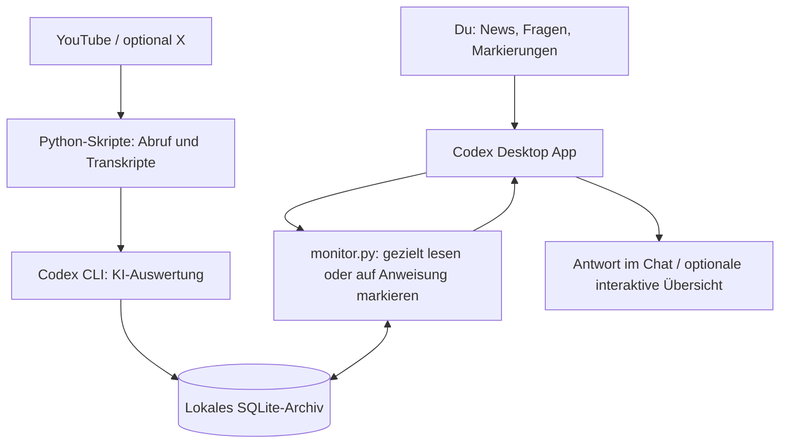

# KI-News-Monitor für die Codex Desktop App

**Dein persönlicher KI-News-Monitor in der Codex Desktop App: Nachrichten per Skript sammeln, im Chat verstehen und gezielt für die eigene Arbeit nutzen.**

## Warum ich das mit Codex nutze

Ich benutze diesen News-Monitor selbst in der **Codex Desktop App**. Für mich liegt die Stärke darin, mit Codex an den Nachrichten weiterzuarbeiten: nachfragen, Quellen prüfen, Ideen für Kundenprojekte entwickeln und interessante Meldungen für später festhalten. Die Skripte übernehmen Abruf und Speicherung; Codex ist mein Gegenüber für die tägliche Arbeit damit.

Ein typischer Ablauf nach der Einrichtung:

> **Ich:** News
>
> **Codex:** Zeigt die gespeicherten ungelesenen Meldungen samt Quellen und Veröffentlichungsdatum.
>
> **Ich:** Welche dieser Meldungen könnte für eine Wissensdatenbank bei einem Kunden interessant sein?
>
> **Codex:** Ordnet passende Meldungen anhand der gespeicherten Belege ein.
>
> **Ich:** Vertiefe diese Meldung und zeige mir die Originalstelle.
>
> **Ich:** Merke sie und halte eine Testidee mit möglichem Kundennutzen fest.

Dies ist ein beispielhafter Bedienablauf, kein wörtlicher Chatmitschnitt. Bei einer unklaren Auswahl fragt Codex nach der Meldungs-ID. Markierungen werden erst auf ausdrücklichen Auftrag gespeichert.

## Was du nach dem Klonen bekommst

**Das Repository enthält die Gestaltung meiner News-Übersicht und die Regeln für die Zusammenarbeit mit Codex. Eine identische Darstellung unmittelbar nach dem Klonen ist damit noch nicht garantiert.**

| Teil meiner Nutzung | Was du dafür brauchst |
| --- | --- |
| Mit Codex über Nachrichten sprechen, Originalstellen abrufen und Meldungen markieren | Lokales Projekt in der Codex Desktop App, eingerichtete Skripte, eigenes Archiv und passende Ausführungsrechte. |
| Interaktive Übersicht mit Filtern und Schaltflächen direkt im Chat | Zusätzlich den `visualize:visualize`-Skill und eine kompatible App-Integration für Darstellung und Aktionsnachrichten. Beides wird hier nicht mitgeliefert. |
| Gestaltung des Lesepults | Die enthaltene Vorlage `ui/news-lesepult.template.html`; Codex soll sie wiederverwenden. |
| Nachrichten, Quellenwahl und persönliche Markierungen | Deine eigene lokale Einrichtung. Mein privates Archiv und meine Markierungen werden nicht verteilt. |

Ohne die zusätzliche Darstellungsintegration kannst du nach der Einrichtung im Codex-Chat mit Textantworten arbeiten. Die HTML-Vorlage allein aktiviert keine interaktive Oberfläche. Die vollständige Übernahme der interaktiven Ansicht auf eine frische fremde Codex-Installation wurde bisher nicht nachgewiesen.

## So spielen Codex und die Skripte zusammen

Du öffnest das eingerichtete Projekt in Codex und schreibst **„News“**. Codex liest dein lokales Archiv, zeigt ungelesene Meldungen und hilft dir, einzelne Themen zu vertiefen. Du kannst nach Originalstellen fragen, Meldungen merken oder eine konkrete Testidee samt Kundennutzen festhalten. Die Skripte speichern diese Entscheidungen dauerhaft, sodass du in einer neuen Aufgabe am selben Archiv weiterarbeiten kannst.

Das experimentelle macOS-Projekt verbindet drei Teile:

| Bestandteil | Aufgabe |
| --- | --- |
| **Codex Desktop App** | Deine Bedienoberfläche: Fragen stellen, Meldungen einordnen, Quellen vertiefen und Markierungen beauftragen. |
| **Python-Skripte + Codex CLI** | YouTube und optional X abrufen, Transkripte verarbeiten, einzelne Themen mit KI extrahieren und gleiche Ereignisse zusammenführen. |
| **Lokales SQLite-Archiv** | Meldungen, Originalbelege, Bearbeitungsstände, Merkliste und Testliste dauerhaft speichern. |



Die Desktop App übernimmt die Gesprächsführung; für die automatisierte Quellenanalyse rufen die Skripte separat die Codex CLI auf. Ein eingerichteter macOS-Zeitplan kann die Sammlung auch bei geschlossener Desktop App ausführen. Das Archiv liegt auf dem Mac, die KI-Auswertung erfolgt über Codex.

Kundenlösungen, eigene technische Umsetzung und Marketing werden gleich gewichtet. Ausgaben auf Deutsch, Originalstellen mit Zeitmarken in der Quellensprache. Quellenbehauptungen, eigene Einschätzungen und Werbung bleiben getrennt.

## Voraussetzungen

- macOS und Python 3.10 oder neuer; Python verwendet ausschließlich die Standardbibliothek.
- Für die Bedienung im Chat: Codex Desktop App mit Zugriff auf den lokalen Projektordner und Berechtigung, die Python-Skripte auszuführen. Die Terminalbefehle funktionieren auch ohne Desktop App.
- Für echte Abrufe: `yt-dlp` im PATH.
- Für KI-Auswertungen: eine installierte Codex CLI mit eigener ChatGPT-Anmeldung und einem verfügbaren Modell. Die Auswertung nutzt deren Kontingent; es gibt keine API-Key-Ausweichroute.
- Optional für Beiträge ohne Untertitel: `ffmpeg`, `whisper-cli` und eine kompatible lokale Whisper-Modelldatei. Das Modell wird nicht mitgeliefert.

Die vorhandene Codex-Aufrufintegration setzt unter anderem `--ignore-user-config`, `--ephemeral` und `--output-schema` voraus. CLI-Versionen können abweichen; bei unbekannten Optionen endet die Verarbeitung mit dokumentiertem Fehler. Dieses Repository installiert keine Werkzeuge und richtet keine Anmeldung ein.

## Einrichtung

Im Projektordner:

```sh
python3 scripts/setup.py
```

Danach `config.json` bearbeiten:

- `model`: Platzhalter durch ein in der eigenen Anmeldung verfügbares Modell ersetzen.
- `youtube` und `x`: gewünschte Handles ohne `@`; X ist zunächst deaktiviert.
- `initial_since`: fester Beginn des Erfassungszeitraums, inklusive Zeitzonenoffset. Das Setup setzt ihn auf vor sieben Tagen.
- `tools`: Programmnamen im PATH oder absolute Pfade eintragen.
- `whisper_model`: absoluter Pfad oder Pfad relativ zum Projektordner.

`config.json` ist lokal und wird von Git ausgeschlossen. Alternativ wählt `NEWS_MONITOR_CONFIG` eine andere Konfigurationsdatei. `NEWS_MONITOR_DATA` wählt einen anderen Datenordner; relative Datenpfade beziehen sich auf das Arbeitsverzeichnis.

## Offline ausprobieren

Nach dem Setup ohne externe Werkzeuge, Anmeldung oder Netzwerk:

```sh
python3 scripts/demo.py
NEWS_MONITOR_DATA=data/demo python3 monitor.py list --filter unread
NEWS_MONITOR_DATA=data/demo python3 monitor.py show 1
NEWS_MONITOR_DATA=data/demo python3 monitor.py passage 1
```

Die Demo enthält ausschließlich erfundene Inhalte und verwendet ein separates Archiv. Wiederholtes Ausführen legt keine doppelte Meldung an.

## Eigene Nachrichten abrufen

Nach Anpassung der Konfiguration:

```sh
python3 monitor.py run
python3 monitor.py status
python3 monitor.py list --filter unread --limit 10
python3 monitor.py list --query Telefon
python3 monitor.py show 1
python3 monitor.py passage 1
```

IDs sind Beispiele. `collect` ruft nur ab, `process` setzt die Auswertung fort, `reconcile` gleicht Themen ab. Anzeigen verändert niemals Markierungen.

```sh
python3 monitor.py state 1 --read yes --reason 'Ausdrücklich als gelesen markieren'
python3 monitor.py state 1 --saved yes --reason 'Für später merken'
python3 monitor.py state 1 --testing yes --idea 'Dokumentensuche ausprobieren' --benefit 'Interne Suche vereinfachen' --reason 'Auf Testliste setzen'
```

## In der Codex Desktop App benutzen

### Projekt öffnen und einrichten

1. Dieses Repository klonen oder herunterladen und den lokalen Ordner in der Codex Desktop App als Projekt öffnen. Verwende den Ordner, in dem `monitor.py` und `AGENTS.md` liegen.
2. Eine lokale Aufgabe in diesem Projekt starten. Für die Nutzung des Archivs im ursprünglichen Projektordner arbeiten: Ein separater Git-Worktree enthält die ignorierten Dateien `config.json` und `data/` nicht automatisch.
3. Die oben beschriebene Einrichtung durchführen oder Codex damit beauftragen:

   > Lies README.md und AGENTS.md und hilf mir, diesen News-Monitor einzurichten. Prüfe zuerst die vorhandenen Werkzeuge. Frage mich nach meinen Quellen und dem verfügbaren Modell. Überschreibe keine vorhandene Konfiguration und starte noch keinen Sammellauf.

4. Nach der Einrichtung den ersten Abruf ausdrücklich anfordern:

   > Sammle und verarbeite jetzt die Nachrichten aus meinen konfigurierten Quellen. Berichte anschließend über den Status und mögliche Abruflücken.

Lokale Projekte stellen den Dateizugriff bereit; `AGENTS.md` enthält die projektbezogenen Arbeitsregeln. Diese Grundlagen beschreibt die offizielle OpenAI-Dokumentation zu [Projekten](https://learn.chatgpt.com/docs/projects) und [AGENTS.md](https://learn.chatgpt.com/docs/agent-configuration/agents-md). Die folgenden Nachrichtenabläufe werden durch dieses Repository vorgegeben.

### Im Alltag einfach fragen

> News

Codex prüft den Archivstatus und zeigt standardmäßig Ungelesenes. Dieser Kurzstart startet keinen neuen Sammellauf. Ein frisches Archiv enthält erst nach dem ersten Abruf Meldungen.

| Dein Auftrag im Chat | Was im Projekt passiert |
| --- | --- |
| „Zeige mir ungelesene Meldungen zu Telefon-KI.“ | `list --filter unread --query Telefon` grenzt das Archiv ein; Codex bereitet die Ergebnisse auf. |
| „Vertiefe Meldung 42 und zeige die Originalstellen.“ | `show 42` lädt die Belegübersicht; `passage BELEG_ID` liefert die zugehörigen Originalstellen. |
| „Merke Meldung 42 für später.“ | `state 42 --saved yes --reason …` speichert die Markierung. |
| „Setze Meldung 42 auf die Testliste und schlage einen Pilotversuch mit Kundennutzen vor.“ | Codex formuliert Testidee und Nutzen und speichert beides mit `state`. Ein Testergebnis wird dabei nicht erfunden. |
| „Markiere Meldung 42 als gelesen.“ | `state 42 --read yes --reason …` setzt ausdrücklich den Lesestatus. |
| „Zeige meine Merkliste.“ | `list --filter saved` liest die gespeicherten Markierungen. |

IDs sind Beispiele und werden durch tatsächliche Meldungs-IDs ersetzt. Bei unklarer Zuordnung muss Codex nachfragen. Öffnen, Anzeigen und Vertiefen ändern den Lesestatus nicht. Die Übersicht nennt zu jeder Meldung Quelle, Link und Veröffentlichungsdatum; offene Abrufprobleme bleiben sichtbar.

### Warum Skripte und Chat zusammengehören

`AGENTS.md` und `NEWS-WORKFLOW.md` verbinden deine Chataufträge mit den vorhandenen Befehlen. Codex liest gezielt relevante Meldungen und Belege aus dem Archiv. SQLite hält die Ergebnisse und deine Markierungen unabhängig vom Chatverlauf fest. Eine neue lokale Aufgabe im selben eingerichteten Ordner kann deshalb wieder dort ansetzen. Kopierst du nur das öffentliche Repository auf einen anderen Rechner, musst du Einrichtung und Archiv separat bereitstellen.

### Interaktive Übersicht direkt im Chat

Mit verfügbarem `visualize:visualize`-Skill und einer Desktop-Integration für Aktionsnachrichten zeigt Codex die mitgelieferte HTML-Ansicht im Chat. Sie bietet Filter, Quellenlinks, Merkliste, Testliste und Markierungen. Die Integration ist nicht Bestandteil dieses Repositorys und nicht für jede App-Installation vorausgesetzt. **Die Bedienung über normale Chatnachrichten funktioniert auch ohne diese Ansicht:** Codex führt die gleichen Skriptbefehle aus und antwortet als Text.

Ein Klick auf eine Markierungsschaltfläche übergibt einen Auftrag an Codex. Erst der erfolgreiche `state`-Befehl schreibt ins Archiv; danach wird die Ansicht aktualisiert. Die HTML-Datei selbst hat keine direkte Schreibverbindung zur Datenbank. Details stehen in [NEWS-WORKFLOW.md](NEWS-WORKFLOW.md).

Die Vorlage lässt sich mit den erfundenen Demodaten exportieren:

```sh
NEWS_MONITOR_DATA=data/demo python3 scripts/render_news.py --output exports/demo.html
```

Für die Demo im Chat Codex ausdrücklich anweisen, bei allen Archivbefehlen `NEWS_MONITOR_DATA=data/demo` zu setzen. Ein HTML-Export allein richtet keine Chatintegration ein. Gerenderte Ansichten enthalten Archivdaten und gehören nicht ins öffentliche Repository.

## Optionaler täglicher Betrieb auf macOS

```sh
python3 scripts/make_launchagent.py
```

Dies erzeugt nur `dist/local.ai-news-monitor.plist` mit den lokalen Pfaden. Es wird kein Dienst installiert oder gestartet. Erst nach erfolgreichem manuellem Lauf und Prüfung der Datei kann sie bewusst installiert werden:

```sh
mkdir -p ~/Library/LaunchAgents
cp dist/local.ai-news-monitor.plist ~/Library/LaunchAgents/local.ai-news-monitor.plist
launchctl bootstrap gui/$(id -u) ~/Library/LaunchAgents/local.ai-news-monitor.plist
```

Entfernen aus dem laufenden Betrieb:

```sh
launchctl bootout gui/$(id -u)/local.ai-news-monitor
```

Der Zeitplan nutzt die konfigurierte Zeitzone, prüft stündlich auf Nachholbedarf und verhindert überlappende Läufe. Ein eingeschalteter Mac und eine angemeldete Benutzersitzung sind erforderlich. Bei bereits bestehender Monitor-Installation keinen zweiten Dienst mit denselben Quellen aktivieren.

## Grenzen und Daten

- YouTube-Abrufe und Untertitel können fehlen oder blockiert sein. Der vollständige Audio-Fallback ist in dieser Veröffentlichung nicht mit einem echten Video nachgewiesen.
- X verwendet eine öffentliche Einbettungs-Timeline ohne Vollständigkeitsgarantie oder verifizierte Pagination. Medien und verlinkte Artikel werden nicht ausgewertet.
- KI-Extraktion, Bewertung und Zusammenführung können Fehler enthalten. Quelleninhalte sind keine unabhängig bestätigten Fakten.
- SQLite, Originaltexte, Audio, Modelle, Logs und Backups liegen unter `data/`. Sie werden nicht mitgeliefert. Es gibt keine automatische Datenlöschung; lokale Backups ersetzen keine Sicherung auf einem anderen Datenträger.
- Die KI-Auswertung übergibt Quellenabschnitte an die konfigurierte Codex CLI. Das Archiv liegt lokal; die KI-Auswertung ist nicht vollständig offline.
- Standardmäßig bleiben Störungen im Status gespeichert; keine E-Mails oder lokalen Benachrichtigungen.
- Windows wird wegen `fcntl` und des macOS-Zeitplans nicht unterstützt; Linux wurde nicht separat geprüft.

## Entwicklung

```sh
python3 scripts/setup.py  # nur falls config.json noch fehlt
python3 -m unittest discover -s tests -v
```

Die Tests verwenden temporäre Datenbanken und benötigen kein Netzwerk. Sie prüfen unter anderem Persistenz, getrennte Markierungen, Belege, Zusammenführungen und Zeitumstellung. Sie ersetzen keinen echten Abruf-/Modellintegrationstest.

Siehe [VALIDIERUNG.md](VALIDIERUNG.md) für die tatsächlich ausgeführten Prüfungen. MIT-Lizenz: [LICENSE](LICENSE).
